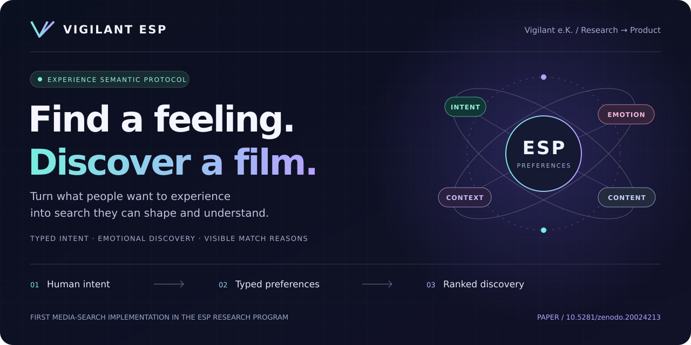
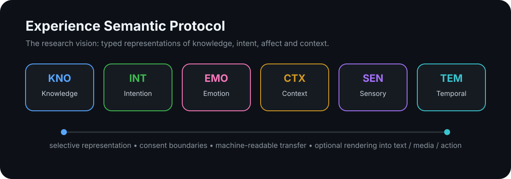
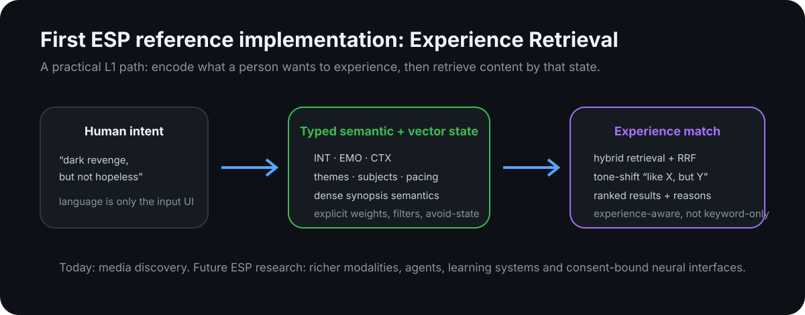

<p align="center">
  
</p>

# Vigilant ESP — Emotional Movie Search Engine

<p align="center">
  <strong>Search by experience, not just by words.</strong><br/>
  Vigilant e.K.’s first practical reference implementation in the <strong>Experience Semantic Protocol (ESP)</strong> research program.
</p>

<p align="center">
  <a href="https://doi.org/10.5281/zenodo.20024213"></a>
  
  
  
</p>

<p align="center">
  <a href="https://doi.org/10.5281/zenodo.20024213"><strong>Read the ESP paper ↗</strong></a> &nbsp;·&nbsp;
  <a href="#what-this-repository-implements-today">Explore the engine</a> &nbsp;·&nbsp;
  <a href="#quick-start">Run an evaluation</a> &nbsp;·&nbsp;
  <a href="mailto:info@vigilant-crs.de">Commercial licensing</a>
</p>

**Find the experience you want.** Translate natural language, an emotion wheel and explicit preferences into ranked films with visible match reasons. Built for streaming providers and catalogue owners who want more control over discovery.

<p align="center">
  
</p>

## From the ESP paper to a running system

The research paper **[The Experience Semantic Protocol — A North Star for Post-Linguistic Communication](https://doi.org/10.5281/zenodo.20024213)** motivates our starting question:

> What if machines did not always have to reduce human meaning to a sentence before they could work with it?

ESP treats parts of experience as **typed, machine-readable semantic states**. In the full research direction, those states are separated into domains such as **knowledge (KNO), intention (INT), emotion (EMO), context (CTX), sensory information (SEN), and temporal structure (TEM)**.

The long-term objective is not “mind reading” and not the claim that subjective experience has already been solved. The objective is a **testable protocol direction** in which meaning can be represented, selectively shared, matched, transformed and rendered into language only when language is useful.

**Vigilant ESP is our first concrete application of that idea inside the ESP program.** It explores media discovery, a use case in the paper’s L1 research direction. It is an application of the typed-representation approach; full L1 protocol conformance has not been established.

<p align="center">
  
</p>

A user can ask for:

```text
"dark revenge movies with a happy ending"
"something like Amélie, but with more action"
"90s mafia films"
"feel-good science fiction"
"a tense thriller, but without hopelessness"
```

Instead of treating those requests as bags of keywords, the engine converts them into an **experience-oriented semantic state**, matches that state against structured film DNA, and returns ranked results with explicit reasons.

---

## Why ESP?

Language is extraordinarily powerful, but it is also a compression layer. People often know **what they want to feel, avoid, understand or experience** before they know the exact words for it.

Traditional search tends to force that intent through title matches, genres and keywords. A richer semantic interface can preserve more structure:

| Conventional interface | ESP direction |
|---|---|
| text first | meaning/state first, text optional |
| one undifferentiated embedding | typed semantic spaces |
| “similar” as a black box | explicit dimensions and weights |
| limited control over emotional direction | emotion can be represented, masked or excluded |
| app-specific semantics | interoperable semantic state is the research goal |
| result only | result + match reasons |

The immediate benefit is **controllable experience retrieval**: users can inspect extracted intent, adjust channel weights and express what to avoid. The broader research value is a common semantic layer that could eventually connect media systems, assistants, learning tools, agent systems and — only when the science and safety are mature enough — consent-bound neural interfaces.

---

## What this repository implements today

This repository implements the **media-search application of ESP’s typed-semantic approach**. The six research types are a conceptual framework; the engine uses the four retrieval channels documented below.

The paper’s wire format, encrypted transport, cryptographic consent capabilities, learned six-type encoder/decoder and ExperienceBench validation are **outside this implementation**. Matching explanations describe shared tags and channel contributions; they do not demonstrate subjective experience transfer.

The current engine exercises **INT / EMO / CTX most directly**, with additional structured content features that approximate parts of sensory and temporal experience. It combines:

- natural-language intent extraction;
- an explicit emotional and thematic ontology;
- dense semantic synopsis embeddings;
- structured sparse vectors for emotion, themes and subjects;
- “like X, but Y” tone-shift queries;
- hard filters and negative/avoid constraints;
- explainable match reasons;
- a visual emotion-wheel interface;
- local or hosted language-model backends;
- on-premise Docker deployment.

### Current retrieval channels

| Channel | Dimensionality | Purpose |
|---|---:|---|
| `synopsis_dense` | 1024 | semantic meaning of synopsis text |
| `emotion_sparse` | 30 | Plutchik-derived emotion + viewer-impact signals |
| `theme_sparse` | 88 | plot themes, genres, settings, moods and pacing |
| `subject_sparse` | 24 | subject-focused retrieval and filtering |

Additional payload fields include archetype, protagonist characteristics, content features, colour palette and streaming-provider metadata.

Fusion uses **weighted Reciprocal Rank Fusion (RRF)** so that different semantic channels remain independently tunable rather than collapsing the whole query into a single opaque score.

---

## Architecture

```text
Human query / UI
      │
      ▼
Intent extraction
      │
      ├──────────────► explicit filters / avoid-state
      │
      ▼
Typed semantic + vector query
      │
      ├── synopsis_dense
      ├── emotion_sparse
      ├── theme_sparse
      └── subject_sparse
      │
      ▼
Qdrant hybrid retrieval
      │
      ▼
weighted RRF + post-fusion rules
      │
      ▼
ranked films + match reasons
```

Full request-path diagrams, sequence diagrams and measured latency notes are in **[docs/ARCHITECTURE.md](docs/ARCHITECTURE.md)**.

---

## Product model

Vigilant ESP is designed as a **search and experience-intent layer** that can sit above an existing catalogue and existing content intelligence.

It does **not** require a streaming provider to replace its current metadata stack. A provider can bring its own editorial tags, embeddings or third-party content intelligence and map those signals into the canonical Vigilant ESP representation.

Two integration paths follow from this design:

1. **Available today: metadata ingestion** — submit film metadata through the JSON or CSV ingest API; the engine extracts film DNA and indexes it.
2. **Custom integration: existing content intelligence** — map editorial tags or other content signals into the canonical schema. This requires an adapter; the standard ingest API does not accept arbitrary external embeddings or precomputed DNA.

The architectural goal is to make the **front door of discovery** understand experiential intent.

---

## Quick start

For evaluation under [LICENSE](LICENSE), start with an authorized checkout:

```bash
git clone git@github.com:Vigilant-CRS/Experience-Semantic-Protocol_Emotional-Movie-Search-Engine.git
cd Experience-Semantic-Protocol_Emotional-Movie-Search-Engine
cp .env.example .env
# set OPENAI_API_KEY, or configure a supported local/OpenAI-compatible backend
# set ADMIN_API_KEYS for catalogue ingestion

docker compose up -d
docker compose logs -f api
```

Then open:

- **http://localhost:8000** — reference frontend
- **http://localhost:8000/api/docs** — interactive API documentation
- **http://localhost:8000/api/health** — health endpoint

A fresh checkout starts with an empty catalogue. Ingest your own licensed film metadata using the [JSON or CSV guide](docs/API_GUIDE.md), with your configured `X-API-Key`, before searching. Film data, model weights and Qdrant snapshots are not bundled in Git.

### Example API query

```bash
curl -X POST http://localhost:8000/api/search \
  -H "Content-Type: application/json" \
  -d '{
    "query": "a tense revenge film, cathartic but not hopeless",
    "limit": 10
  }'
```

For catalogue ingestion and production integration, see **[docs/API_GUIDE.md](docs/API_GUIDE.md)** and **[INSTALL.md](INSTALL.md)**.

---

## Reference implementation status

The repository snapshot includes:

- ingestion and retrieval code for customer-supplied catalogues;
- schema-v2 separation of emotion/viewer-impact and subjects;
- plug-and-play catalogue ingestion;
- externalized engine parameters;
- automatic CPU/GPU selection;
- hosted or local language-model paths;
- evaluation scripts for predictable, free-text and tone-shift queries.

The existing [architecture notes](docs/ARCHITECTURE.md) record measurements from an internal 15,255-film demo corpus. That corpus is not distributed with this repository, and those measurements are not a benchmark guarantee. Free-text latency depends on the selected intent-extraction backend.

---

## What this could enable next

The point of this repository is larger than movie search. It demonstrates an application built around structured **experience preferences**: intent, affective tags, context and explicit constraints.

The same design direction can be explored for:

- music, games, books and creator-asset discovery;
- cross-media search (“find a game that feels like this film”);
- assistants that exchange typed intent/context instead of repeatedly paraphrasing everything into prose;
- learning systems that separate knowledge, intention, context and affective state;
- privacy-bounded collective or agent memory;
- richer human-machine interfaces in which language is one rendering option among several;
- future BCI research, where neural features could map into the same typed semantics instead of requiring an entirely new application protocol.

These are **research directions**, not claims that this repository already implements full experience transfer.

---

## Research paper

**The Experience Semantic Protocol — A North Star for Post-Linguistic Communication**

- DOI: **[10.5281/zenodo.20024213](https://doi.org/10.5281/zenodo.20024213)**
- Author: **Damir Đulović** · Version **7** · Published **4 May 2026**
- Record: **[Zenodo 20024213](https://zenodo.org/records/20024213)**
- Paper license: **CC BY 4.0**, as recorded on Zenodo. The software has its own [proprietary license](LICENSE).

The paper proposes **Typed Approximately Orthogonal Semantic Subspaces (TAOSS)**, a wire format and consent capabilities for selectively sharing representations of experience. It identifies proven results, conjectures and falsifiable research hypotheses separately. The six types are an engineering proposal; their separation and usefulness across domains remain research questions.

### Cite and discuss the research

Use GitHub’s **Cite this repository** action or copy this paper citation:

```bibtex
@misc{dulovic2026esp,
  author    = {Đulović, Damir},
  title     = {The Experience Semantic Protocol — A North Star for Post-Linguistic Communication},
  year      = {2026},
  publisher = {Zenodo},
  version   = {7},
  doi       = {10.5281/zenodo.20024213},
  url       = {https://doi.org/10.5281/zenodo.20024213}
}
```

Research questions, replication work and collaboration inquiries are welcome at **[info@vigilant-crs.de](mailto:info@vigilant-crs.de)**. When discussing the protocol, cite the paper; when describing engine behavior, also reference the repository and commit you examined.

If you are researching semantic communication, multimodal interfaces, human-machine communication, experience representation, collective intelligence or future BCI protocols, the paper is the conceptual specification behind this implementation.

---

## Repository map

| Path | Role |
|---|---|
| `api_v3.py` | FastAPI service |
| `frontend/index.html` | reference SPA / emotion-wheel UI |
| `config/ontology_v3/` | canonical ontology and translations |
| `config/engine_params.yaml` | retrieval and scoring parameters |
| `scripts/extract_dna_v3.py` | semantic DNA extraction |
| `scripts/reindex_v3.py` | Qdrant collection build/rebuild |
| `scripts/search_v3.py` | hybrid retrieval and fusion |
| `scripts/llm_local.py` | local GGUF backend |
| `docs/ARCHITECTURE.md` | architecture and request flow |
| `docs/API_GUIDE.md` | integration guide |

---

## License and commercial use

Vigilant ESP is **proprietary commercial software**. See **[LICENSE](LICENSE)**.

Evaluation copies are not redistributable. Production use, redistribution, derivative commercial products and hosted-service use require a separate commercial agreement.

**Licensor / commercial contact**  
Vigilant e.K.  
**info@vigilant-crs.de**

Third-party components remain subject to their own licenses. See **[THIRD_PARTY_NOTICES.md](THIRD_PARTY_NOTICES.md)** and **[LICENSES_MANIFEST.md](LICENSES_MANIFEST.md)**.

### TMDB attribution

This product uses the TMDB API but is not endorsed or certified by TMDB. Required TMDB attribution is included in the bundled frontend.

---

<p align="center">
  <strong>Vigilant e.K.</strong><br/>
  Experience Semantic Protocol research &amp; reference implementations<br/>
  <a href="mailto:info@vigilant-crs.de">info@vigilant-crs.de</a>
</p>
