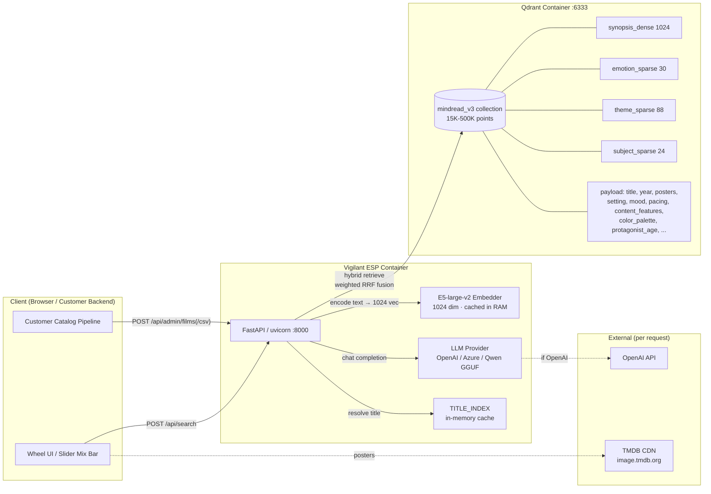
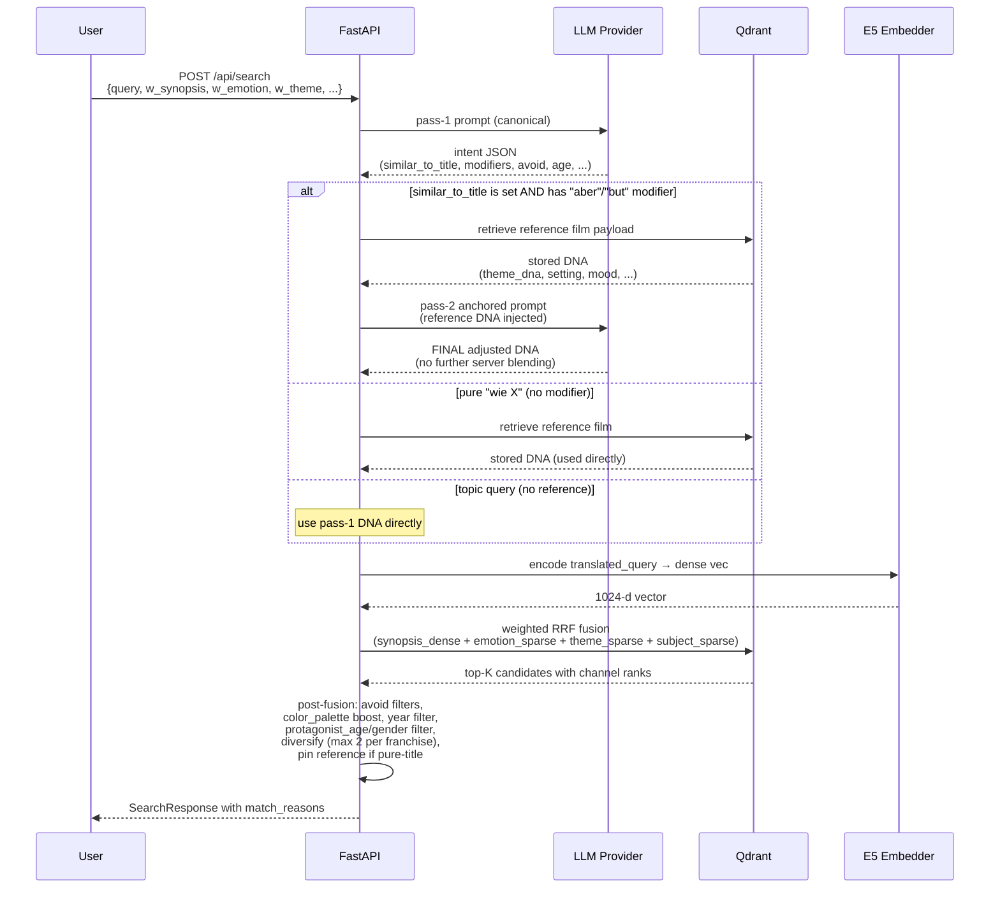
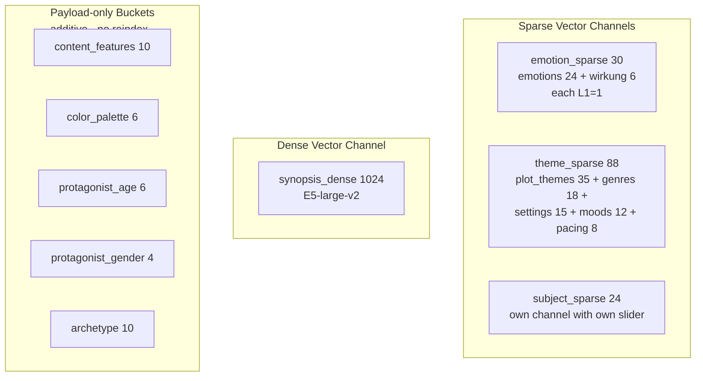

# Architecture

*Vigilant ESP — Experience Semantic Protocol (engine codename: MindRead V3).*

## High-Level Overview



## Request Path: Free-Text Query



## Hybrid Retrieval — Vector Layout

The collection has **four named vectors per film**, plus a JSON payload.
Each channel is queried independently and their rank lists are fused
with weighted RRF (Cormack 2009 extension):

```
score(d) = Σ_c w_c · 1 / (60 + rank_c(d))
```

| Channel | Dim | Source | Captures |
|---|---|---|---|
| `synopsis_dense` | 1024 | E5-large-v2 of overview text | Semantic synopsis similarity |
| `emotion_sparse` | 30 | Plutchik 8×3 + Wirkung 6 | Protagonist feelings + viewer impact (separately L1-normalised) |
| `theme_sparse` | 88 | plot_themes(35) + genres(18) + settings(15) + moods(12) + pacing(8) | Story DNA |
| `subject_sparse` | 24 | Subjects bucket (mafia, vampire, …) | Topical "what it's about" |

Plus payload-only buckets (additive, no reindex required to extend):
- `content_features` (10 advisories — firearms, drug_use, …) → hard `must_not`
- `color_palette` (6 — warm, neon_noir, …) → soft re-rank
- `protagonist_age` (6 — child, …, senior) → hard filter when no reference
- `protagonist_gender` (4) → hard filter when set
- `archetype`, `streaming_providers`, `year`, `vote_average`, …

## Ontology Layout (Schema v2, 2026-05)



## Performance Numbers (measured 2026-05-15, n=10 per operation)

Hardware: P620 dev workstation, 15.255 indexed films, single-tenant, CPU-only.

| Operation | P50 | P95 | Notes |
|---|---|---|---|
| `POST /api/search` similar_to=tmdb_id | **147 ms** | **153 ms** | no LLM, just hybrid retrieve + diversify |
| `POST /api/search` topic query (1 LLM call) | **3.26 s** | **3.62 s** | OpenAI gpt-5.4-mini dominates (~2.5 s of total) |
| `POST /api/search` **cached intent (wheel-adjust)** | **259 ms** | **286 ms** | **client reuses prior intent — no LLM call** |
| `POST /api/search` tone-shift (Variant Z, 2 LLM calls) | **6.5 s** | **9.0 s** | pass-1 + anchored pass-2; outlier up to 18 s on OpenAI spikes |
| `POST /api/admin/films` 200 films (OpenAI) | 2-5 min | — | LLM-bound; serial; 0 errors typical |
| Qdrant search alone (any channel) | **<10 ms** | <20 ms | HNSW-indexed |
| E5 encode (single query) | **5-20 ms** | <30 ms | CPU; <2 ms on consumer GPU |

**Key insight for UI design:** after the first search-with-text, the client should retain `intent.emotion_sparse` + `intent.theme_sparse` and pass them back as `adjusted_emotions` + `adjusted_themes` for subsequent slider/wheel changes. That kills the LLM call and the search drops to **~250 ms — feels instant**.

P95 estimate for production catalog (50 K-500 K films):
- Latency unchanged for retrieval (HNSW is log-N)
- LLM-call latency depends on provider; same as demo
- Cold-start (container restart): ~30 s for E5 load + title-index build

## Deployment Topology

Recommended single-node deployment for ≤ 200 K films:

```
┌─────────────────────────────────────────────┐
│  Customer infrastructure (their datacenter) │
│                                              │
│  ┌──────────────┐         ┌──────────────┐  │
│  │ Vigilant ESP │◀───────▶│  Qdrant      │  │
│  │ container    │  HTTP   │  container   │  │
│  │ :8000        │         │  :6333       │  │
│  └──────┬───────┘         └──────┬───────┘  │
│         │                         │          │
│         ▼                         ▼          │
│   E5 weights                 qdrant_data     │
│   (cached vol)               (persistent vol)│
└─────────────────────────────────────────────┘
            │                       ▲
            │ HTTPS                 │ TVA / CSV
            ▼                       │ feed
   ┌────────────────┐      ┌─────────────────┐
   │  OpenAI API    │      │ Customer        │
   │  (or local LLM)│      │ catalog system  │
   └────────────────┘      └─────────────────┘
```

Multi-tenant: replicate the same stack per customer, route via reverse-proxy. Cluster-Qdrant + horizontal API scale is supported by upstream Qdrant but not currently bundled.
